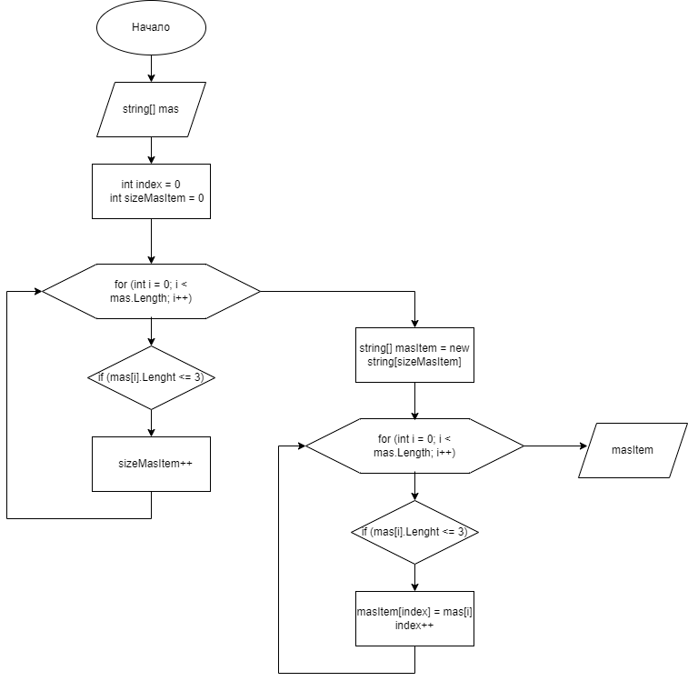

# Приложение "Выборка из массива по условию"
## Описание приложения
Приложение служит для того, что бы брать данные с консоли и преобразововать массив в другой массив данных по условию. В данном примере приложение сохраняет данные по **условию**, если кол-во символов в строке меньше или равно 3.\
Блок-схема:

## Программный код

Полные программый код:

    string[] masInput = Console.ReadLine().Split(" ");
    Console.WriteLine(string.Join(" ", MasChooseItem(masInput)));

    string[] MasChooseItem(string[] mas)
    {
        int index = 0;
        int sizeMasItem = 0;
        for (int i = 0; i < mas.Length; i++)
        {
            if (mas[i].Length <= 3)
            {
                sizeMasItem++;
            }
        }
        string[] masItem = new string[sizeMasItem];
        for (int i = 0; i < mas.Length; i++)
        {
            if (mas[i].Length <= 3)
            {
                masItem[index] = mas[i];
                index++;
            }
        }
        return masItem;
    }

Сокращенный программный код:

    string[] result = Console.ReadLine().
        Split(" ")
        .Where(x => x.Length <= 3)
        .ToArray();
    Console.WriteLine(string.Join(" ", result));

[Ссылка на GitHub][1]

[1]: https://github.com/AntonTokmakov/InterimCertification.git